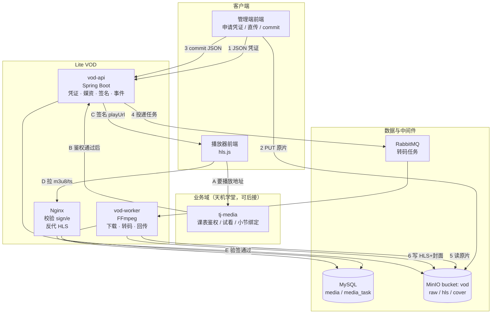
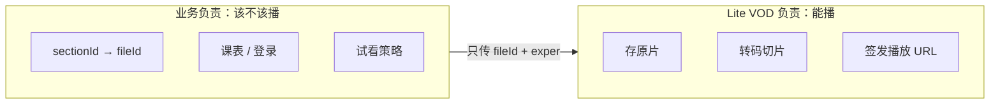
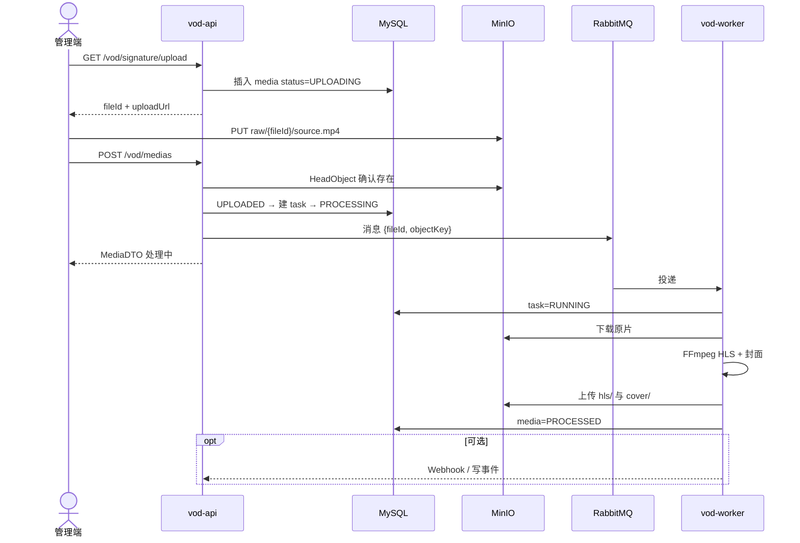
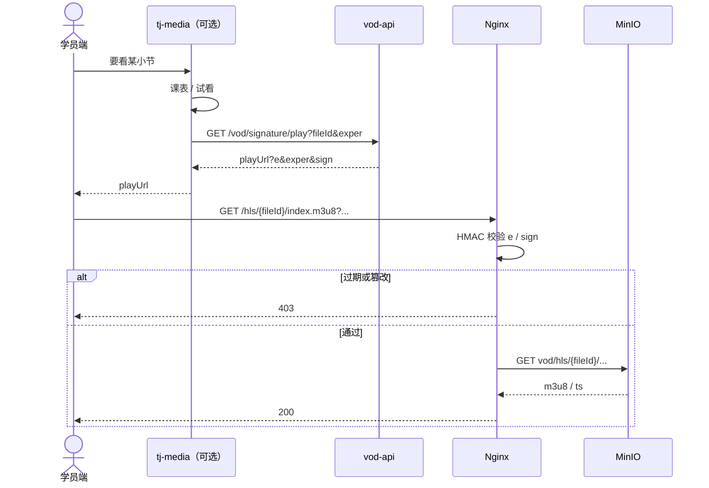
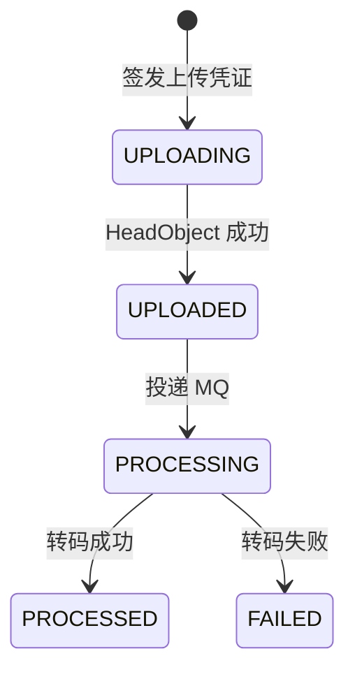
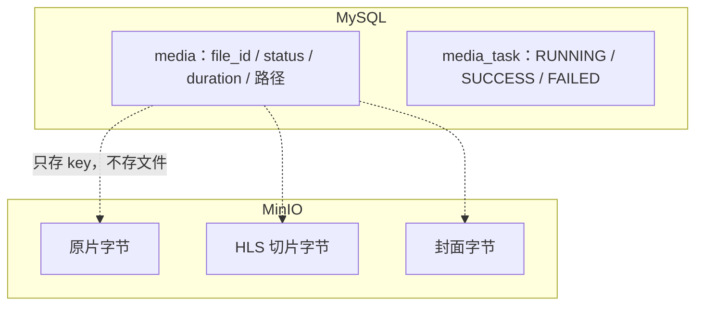
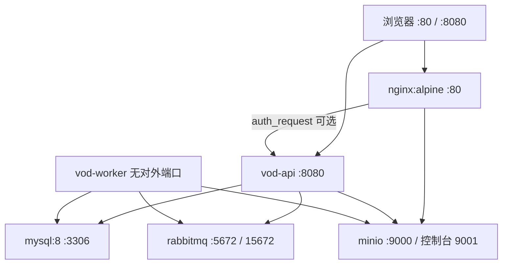
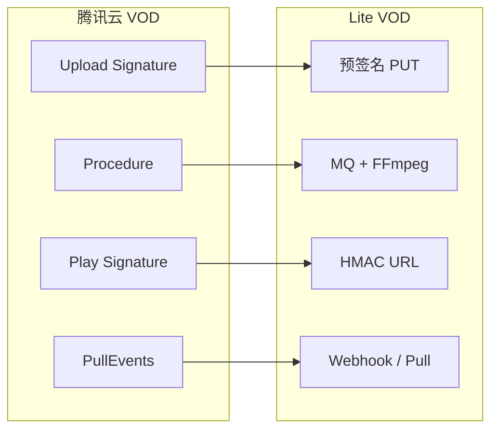

# Lite VOD 核心架构图

> 与 [实现文档](./04-轻量版云点播-Lite-VOD-实现文档.md) 第二章、[前置知识](./03-点播与对象存储-前置知识.md) 第十一章对齐。  
> 在 Cursor / VS Code 中打开预览即可渲染 Mermaid。

---

## 1. 一句话

**字节走 MinIO，状态走 MySQL，任务走 RabbitMQ，播放走 Nginx 验签反代。**  
`vod-api` 不经手文件流；`vod-worker` 不对外提供页面。

---

## 2. 容器全景（核心图）



首期演示可不接 `tj-media`：播放器直接调 `vod-api` 申请签名。

---

## 3. 职责切分



| 组件 | 做什么 | 不做什么 |
| --- | --- | --- |
| vod-api | 预签名、落库、发 MQ、播放 HMAC、查询删除 | 收大文件、跑 FFmpeg |
| vod-worker | 消费队列、转码、回写状态 | 对外 HTTP 业务接口 |
| MinIO | 存对象 | 鉴权课表、改媒资状态 |
| MySQL | 媒资与任务元数据 | 存视频二进制 |
| RabbitMQ | 解耦 API 与转码 | 存文件 |
| Nginx | 验签后反代 `/hls/` | 生成 fileId、转码 |

---

## 4. 上传与转码时序



对象路径：

```text
vod/raw/{fileId}/source.mp4
vod/hls/{fileId}/index.m3u8
vod/hls/{fileId}/segment_xxx.ts
vod/cover/{fileId}.jpg
```

---

## 5. 播放时序（含验签）



原则：MinIO 不对公网匿名读；学员只打播放域名。

---

## 6. 状态与数据落点





---

## 7. 部署拓扑（Compose）



Worker 与 API 分容器，避免 FFmpeg 拖垮接口。

---

## 8. 和腾讯云 VOD 的对应



对接时 `IMediaStorage` 增加 `LiteVodMediaStorage`，门面方法不变。
