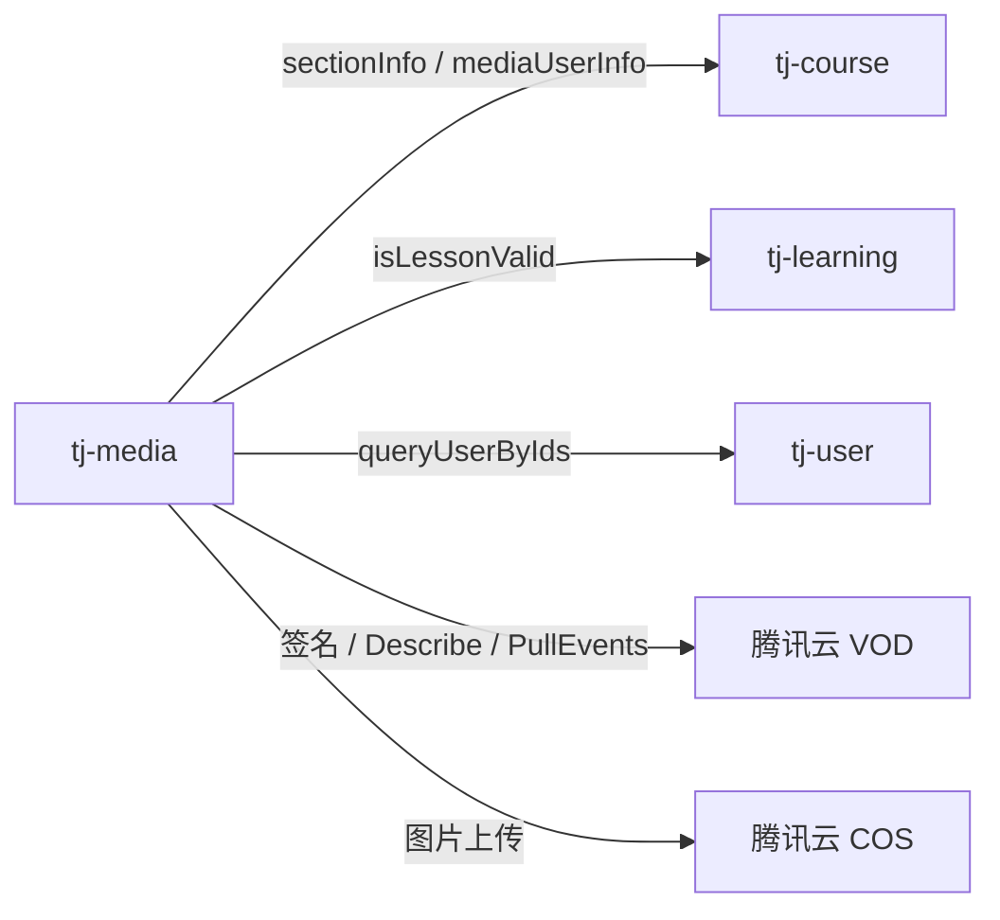

# 天机学堂 `tj-media` 实现说明

> 代码位置：`tianji/tianji/tj-media`（服务名 `media-service`，端口 `8084`，库 `tj_media`）。  
> 对照天机文档目录中的项目熟悉、已完成部分；点播替换见 [Lite VOD 实现文档](./04-轻量版云点播-Lite-VOD-实现文档.md)。  
> 本文只描述**现有实现**，不含 Lite VOD 替换方案。

---

## 一、模块在整体中的位置

`tj-media` 是媒资中心，做两件不同的事：

| 能力 | 存哪里 | 谁上传 | 本模块做什么 |
| --- | --- | --- | --- |
| 视频（点播） | 腾讯云 VOD | 浏览器直传云端 | 签发上传/播放签名；本地表记 fileId、封面、时长 |
| 普通文件（图等） | 腾讯云 COS（可切阿里 OSS） | 经本服务 Multipart | 流式上传对象存储并落 `file` 表 |

视频文件**不经过** Spring 传完整流（管理端走客户端 SDK + 上传签名）。图片等走 `POST /files`，字节会进 `media-service`。

点播鉴权在本服务完成：先问课程、课表，再向腾讯要播放 JWT。转码在云上（VOD Procedure），本服务用定时任务 **PullEvents** 回写封面与状态。

---

## 二、工程结构

```text
tj-media/
├── controller
│   ├── MediaController.java    # /medias 视频媒资
│   └── FileController.java     # /files  普通文件
├── service/impl
│   ├── MediaServiceImpl.java   # 签名、落库、播放鉴权
│   └── FileServiceImpl.java    # 直传 COS/OSS
├── storage
│   ├── IMediaStorage.java      # 视频存储抽象（仅腾讯实现）
│   ├── IFileStorage.java       # 文件存储抽象
│   ├── tencent/
│   │   ├── TencentMediaStorage.java
│   │   └── TencentFileStorage.java
│   └── ali/AliFileStorage.java
├── task/PullEventTask.java     # 拉取 VOD 任务流事件
├── config                      # 平台开关 + 云客户端 Bean
└── domain                      # po / dto / vo / query
```

依赖：`tj-api`（Feign）、`tj-auth-resource-sdk`、腾讯 `vod`/`cos` SDK、阿里 OSS SDK。  
Java 11 + Spring Cloud + Nacos + MyBatis-Plus。启动类开启 `@EnableScheduling`。

平台开关（`bootstrap.yml` 中 `tj.platform`）：

- `media: TENCENT` → 注入 `VodClient` + `TencentMediaStorage`
- `file: TENCENT` → 注入 `COSClient` + `TencentFileStorage`

配置前缀：`tj.tencent`（`appId`、`secretId`、`vod.*`、`cos.*`）。密钥应放 Nacos / 环境变量，**不要写入仓库**。

---

## 三、数据模型

### 3.1 表 `media`（视频）

对应 `domain.po.Media`。本地只存云端指针和展示字段，不存视频二进制。

| 字段 | 含义 |
| --- | --- |
| id | 本地主键（课程小节绑的是这个 `mediaId`） |
| fileId | 腾讯云媒资 ID |
| filename / mediaUrl / coverUrl | 名称、播放地址、封面 |
| duration / size | 秒、字节 |
| status | 见状态枚举 |
| requestId / creater / deleted | 请求号、创建者、逻辑删 |

`FileStatus`：`UPLOADING(1)`、`UPLOADED(2)`、`PROCESSED(3)`。  
`save` 从云查询后先标 `UPLOADED`；Procedure 完成后 `PullEventTask` 改为 `PROCESSED` 并补封面。

### 3.2 表 `file`（图片等）

对应 `domain.po.File`：`key`（对象键）、原始文件名、`platform`（腾讯/阿里/七牛）、状态。  
返回给前端的访问路径 = `Platform.path` + `key`，例如腾讯 `/img-tx/{uuid}.jpg`。

---

## 四、视频：接口与流程

`MediaController` 前缀 `/medias`。

| 方法 | 路径 | 作用 |
| --- | --- | --- |
| GET | `/medias` | 分页搜媒资（文件名），附引用次数、创建者名 |
| POST | `/medias` | 直传完成后，用 `fileId` 落本地库 |
| GET | `/medias/signature/upload` | 腾讯上传签名 |
| GET | `/medias/signature/play?sectionId=` | 学员播放签名（鉴权） |
| GET | `/medias/signature/preview?mediaId=` | 管理端预览（不校验课表） |
| DELETE | `/medias/{mediaId}` | 按本地 id 删库记录 |
| DELETE | `/medias?ids=` | 批量删库记录 |

鉴权：`tj.auth.resource` 开启。`/medias/signature/play` 配在 `excludeLoginPaths` 中（可不登录访问该路径）；方法里仍读取 `UserContext.getUser()`，水印 uid 在腾讯实现里目前注释掉了。

### 4.1 上传（客户端直传）

```text
管理端 → GET /medias/signature/upload
      → TencentMediaStorage.getUploadSignature()
      → 前端用签名直传腾讯 VOD（可带 procedure）
      → POST /medias  { fileId }
      → DescribeMediaInfos 拉云端元数据
      → 按 fileId 幂等插入 media
```

上传签名：HMAC-SHA1 拼 `secretId`、时间戳、过期、随机数；若配置了 `tj.tencent.vod.procedure`（如 `wisehub-base`），签名里带上任务流名，云端上传后自动转码/截封面。

`save`：`queryMediaInfos(fileId)` 得到 `Media`（此时 `status=UPLOADED`）。若本地已有同一 `fileId`，直接返回，不重复插入。

服务端流式上传 `IMediaStorage.uploadFile`（ApplyUpload → COS TransferManager → CommitUpload）已实现，**当前 Controller 未暴露**，主路径是签名直传。

### 4.2 播放鉴权（核心业务）

`GET /medias/signature/play?sectionId=` → `getPlaySignatureBySectionId`：

```text
1. courseClient.sectionInfo(sectionId)
   → courseId、mediaId、trailer、freeDuration
2. learningClient.isLessonValid(courseId)
   → 有 lessonId：正式播放（exper 不限）
   → 无课表且 trailer=false：403 MEDIA_NOT_FREE
   → 无课表且 trailer=true：试看，exper = freeDuration * 60（秒）
3. 用本地 media.fileId 调 getPlaySignature
4. 返回 VideoPlayVO { fileId, signature }
```

前端拿 `fileId` + JWT 调腾讯播放器，**本服务不反代视频流**。

管理端预览 `getPlaySignatureByMediaId`：只按 `mediaId` 查库签发，无课表校验。

### 4.3 播放签名算法（腾讯）

`TencentMediaStorage.getPlaySignature` 用 `tj.tencent.vod.urlKey` 签 JWT，payload 含：

- `appId`、`fileId`、`currentTimeStamp`
- `pcfg`：播放器配置名（配置项 `pfcg`）
- `urlAccessInfo.exper`：试看秒数（有试看时）

### 4.4 分页列表

按 `filename` 模糊查本地 `media`，再：

- `courseClient.mediaUserInfo(ids)`：各媒资被课程引用次数
- `userClient.queryUserByIds`：创建者姓名

### 4.5 Procedure 回写

`PullEventTask` 每 10 秒 `PullEvents`：

- 关注 `ProcedureStateChanged` 且状态 `FINISH`
- 从结果里取 `CoverBySnapshot` 封面、时长、大小
- `updateMediaProcedureResult`：无记录则 insert，有则更新 `PROCESSED` + `coverUrl`
- 再 `ConfirmEvents` 确认，避免重复拉取

`NewFileUpload` 处理代码存在但注释未启用。无事件时腾讯返回 `no event`，打 debug 日志。

---

## 五、普通文件：接口与流程

`FileController` 前缀 `/files`。

| 方法 | 路径 | 作用 |
| --- | --- | --- |
| POST | `/files` | Multipart 上传 |
| GET | `/files/{id}` | 返回 id、文件名、拼接后的 path |
| DELETE | `/files/{id}` | 默认只删库（见下文缺口） |

`FileServiceImpl.uploadFile`：UUID 重命名 → `IFileStorage.uploadFile` → 写 `file` 表。库写入失败会尝试删云端对象。

当前 `tj.platform.file=TENCENT` 走 COS。`AliFileStorage` 的条件是 `tj.file.platform=ALI`，与 `PlatformProperties` 的 `tj.platform.file` **前缀不一致**，默认配置下阿里 Bean 不会生效。

---

## 六、存储抽象

```text
IMediaStorage          IFileStorage
      │                      │
      ▼                      ▼
TencentMediaStorage    TencentFileStorage
                       AliFileStorage（开关未对齐）
```

`IMediaStorage` 方法：上传签名、播放签名、流式上传、删除、按 fileId 查云端信息。  
视频没有阿里实现，切平台只改 `tj.platform.media` 目前只能是 `TENCENT`。

---

## 七、跨服务依赖



学习服务未实现时，`isLessonValid` 降级常返回 null，播放会走「无课表」分支：免费试看小节能播，收费小节 403。见已完成部分学习文档 4.7 节。

课程侧小节字段 `mediaId` 指向本地 `media.id`，不是腾讯 `fileId`。

---

## 八、实现上的缺口（读代码时注意）

1. **删除视频**：Controller 调用 `removeById(mediaId)`（MyBatis-Plus 只删本地行）。`deleteMedia(fileId)` 会调 `vodClient.DeleteMedia` 再删库，但 HTTP 未接到这条路径。
2. **删除文件**：`DELETE /files/{id}` 同样可能只删库，不删 COS。
3. **播放免登录路径** 与 `UserContext` 并存，水印 uid 未启用。
4. **`VideoPlayVO`** 字段 `signature` 的 Swagger 写成了「视频封面」，实际是播放 JWT。
5. **阿里文件开关** 与 `tj.platform.file` 不一致。
6. **`uploadFile`（VOD 服务端上传）** 无 Controller。

---

## 九、和 Lite VOD 的边界

`tj-media` 是 **业务门面**：课表、试看、媒资引用、本地 `mediaId`。  
腾讯 VOD 是 **存储 + 转码 + 播放器防盗链**。

替换云时保持 `IMediaStorage` 与 `/medias` 契约，在实现里改为调自建 Lite VOD 即可；播放鉴权逻辑应留在 `MediaServiceImpl`。

---

## 十、建议阅读顺序

1. `MediaController`、`FileController`（对外契约）
2. `MediaServiceImpl.getPlaySignatureBySectionId`（业务核心）
3. `TencentMediaStorage`（签名与云 API）
4. `PullEventTask`（转码回写）
5. `TencentConfig` + `PlatformProperties`（如何切实现）
